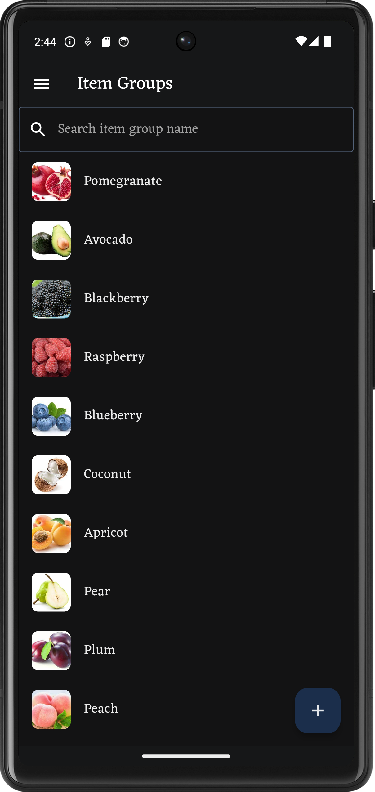

# Warelake: Inventory Organizer

#### Mobile Apps

    
    
    
    

# To run build runner
- `dart run build_runner build`

# To generate icon
- `dart run flutter_launcher_icons`

# To build app for release
- `flutter build appbundle`

# To take screenshot of the screen
- `flutter screenshot`

## List flutter and run it
- `flutter emulators`
- `flutter emulators --launch <emulator id>`
- `flutter run`

# To remove emulator lock
- `rm ~/.android/avd/Pixel_6_API_34.avd/*.lock`

# How to generate firebase_options.dart
- https://stackoverflow.com/a/70405060 

# How to generate keystore.jks
- `keytool -genkey -v -keystore keystore.jks -keyalg RSA -keysize 2048 -validity 10000 -alias <Alias Key>`
- paste `keystore.jks` at the folder android/app